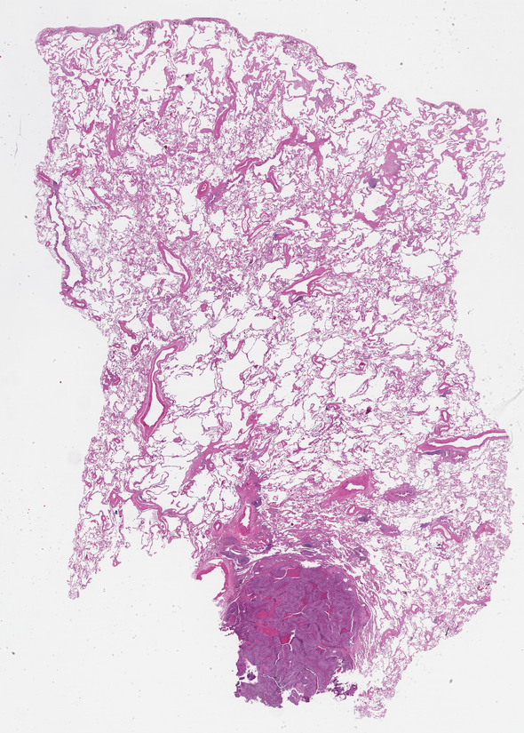
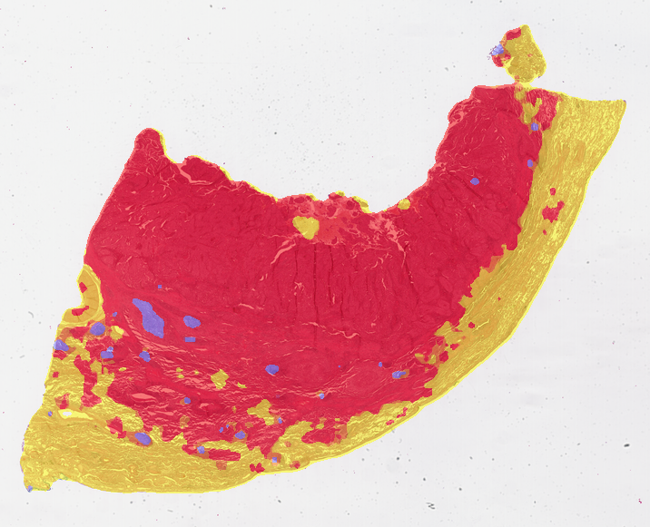

<!-- Welcome Banner -->


<!-- Background Info -->


<!-- <section class="spotlight mostscreen style6 invert orient-center content-align-center onscroll-image-fade-in">

  

    

      

      

      

      

      

      

    

    

    

    

  

</section> -->

<section class="wrapper style1 align-center invert">
  

    

      <h2 class="motto">Model Prediction</h2>
        
Example 1

          

              
              
          

           
           
        
Example 2

          

              
              
          

           
           
        
Example 3

          

              
              
          

      

  

</section>

<!-- Make a Difference -->


<!-- Properties -->




